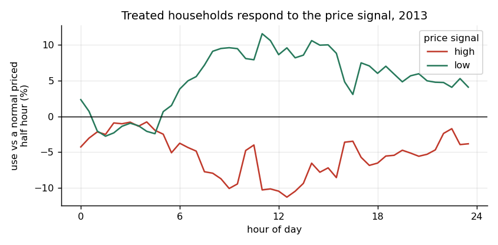
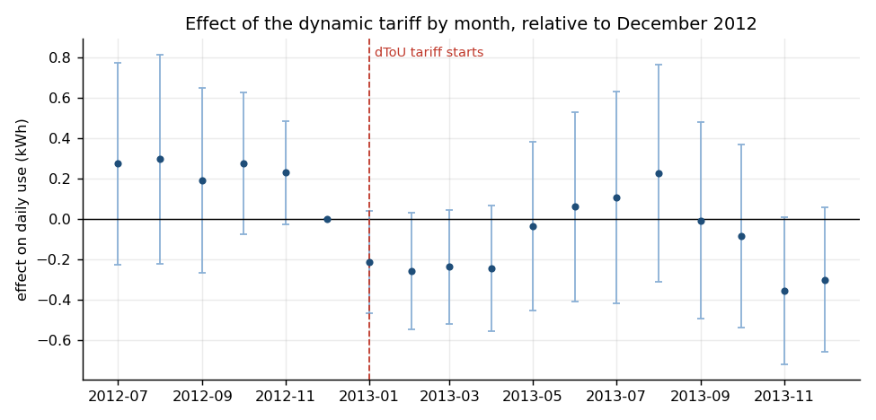
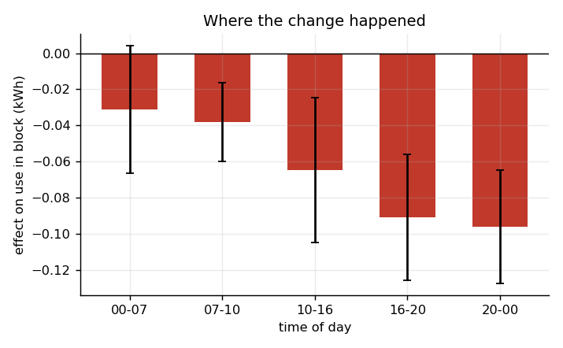
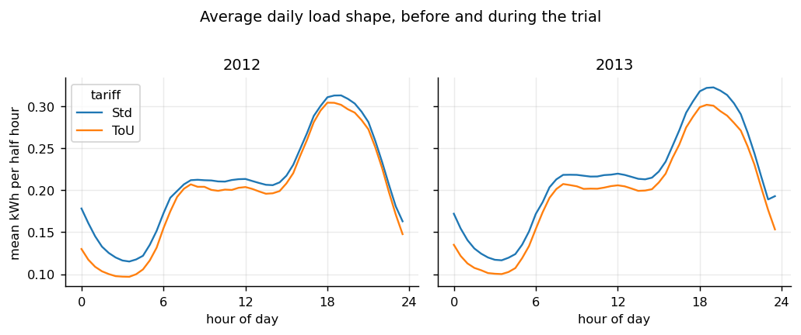
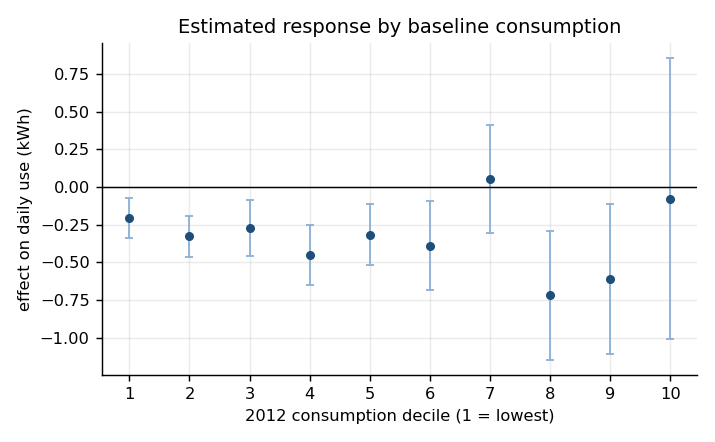
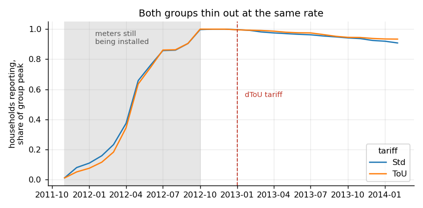

# WattShift London

### Causal evidence on how dynamic electricity prices changed household demand

> A reproducible difference-in-differences analysis of the Low Carbon London
> smart-meter trial. The central finding is simple: dynamic prices changed
> **when** households used electricity more than they changed **how much**
> electricity households used over a full day.


## At a glance

| Result | Estimate | Statistical evidence |
|---|---:|---:|
| Change in treated households' daily consumption | **-0.3229 kWh/day** (**-3.22%**) | 95% CI: -0.4620 to -0.1837; p = 5.45e-06 |
| Response during high-price half-hours | **-4.57%** | 95% CI: -5.79% to -3.34%; p = 7.91e-13 |
| Response during low-price half-hours | **+6.31%** | 95% CI: +4.87% to +7.78%; p < 1e-16 |
| Joint pre-trend test | No detectable differential pre-trend | p = 0.267 |
| Treated versus control attrition | -1.12 percentage points | p = 0.208 |
| Minimum detectable daily effect | 0.1989 kWh/day (1.98%) | 5% significance, 80% power |

The main daily estimate is equivalent to roughly 118 kWh per treated household
over 365 days if the average effect is mechanically annualised. That derived
number is a scale illustration, not a separate model estimate.

## Key finding: households responded to the signal



During 2013, treated and control demand are compared within the same half-hour of
the same date. High-price signals reduced treated demand relative to control,
while low-price signals increased it. The low-price response was larger and low
prices occurred about twice as often as high prices.

| Signal | Price | Half-hours | Share of 2013 | Estimated response | 95% CI | p-value |
|---|---:|---:|---:|---:|---:|---:|
| High | 67.20p/kWh | 788 | 4.50% | **-4.57%** | -5.79% to -3.34% | 7.91e-13 |
| Low | 3.99p/kWh | 1,660 | 9.47% | **+6.31%** | +4.87% to +7.78% | <1e-16 |
| Normal | 11.76p/kWh | 15,072 | 86.03% | Reference | — | — |

The flat-rate comparison group paid 14.228p/kWh. Price signals were sent a day
ahead through the smart-meter in-home display or by text message.

## Research question

Did moving London households from a flat electricity tariff to a dynamic
time-of-use tariff:

1. reduce total daily electricity consumption;
2. shift consumption away from expensive half-hours and toward cheap ones;
3. affect some parts of the day or household consumption groups more than
   others; and
4. create selective dropout that could bias the estimate?

## Study context and data

The project uses
[SmartMeter Energy Consumption Data in London Households](https://data.london.gov.uk/dataset/smartmeter-energy-consumption-data-in-london-households-vqm0d),
published by UK Power Networks through the London Datastore as part of the
[Low Carbon London](https://innovation.ukpowernetworks.co.uk/projects/low-carbon-london)
project.

The published dataset covers November 2011 through February 2014 and describes
5,567 London households with about 167 million half-hourly observations. The
pipeline run underlying this repository processed 167,926,914 valid half-hour
readings. The raw CSV is roughly 10 GB after extraction.

### Analysis sample flow

| Stage | Households | Observations / rule |
|---|---:|---|
| Published trial sample | 5,567 | About 167 million half-hour readings |
| Any usable month in the analysis data | 5,556 | A month needs at least 20 complete days |
| Final complete 18-month panel | **4,169** | Every month from Jul 2012 through Dec 2013 |
| Dynamic tariff in final panel | **844** | 20.2% of final households |
| Flat-rate control in final panel | **3,325** | 79.8% of final households |
| Main monthly-model observations | — | **75,042** household-months |
| Daily robustness observations | — | **2,198,961** household-days |
| 2013 price-signal observations | — | **17,520** calendar half-hours |

The analysis starts in July 2012 because meters were installed in waves. Requiring
a January 2012 start would select the small group installed earliest and leave
too few treated households. A month is usable only when the household reports at
least 20 complete days, and the final sample must appear in all six pre-treatment
months and all 12 post-treatment months.

## Identification strategy

### 1. Main difference-in-differences model

The main outcome is mean daily kWh for household $i$ in month $t$:

$$
Y_{it} = \alpha_i + \lambda_t + \beta
(\text{dToU}_i \times \text{Post}_t) + \varepsilon_{it}
$$

- $\alpha_i$: household fixed effects remove time-invariant differences
  between treated and control households.
- $\lambda_t$: month fixed effects absorb common seasonality and aggregate
  shocks.
- $\beta$: the estimated change for dynamic-tariff households after
  January 2013, relative to the flat-rate group.
- Standard errors are clustered by household.

The design is quasi-experimental. The repository does not assume that assignment
was random; it relies on a parallel-trends assumption after controlling for
household and time fixed effects.

### 2. Event study

Treatment is interacted with each month, using December 2012 as the reference.
The pre-treatment coefficients test whether the two groups were already moving
differently before the tariff began.



The five estimated pre-period coefficients are jointly indistinguishable from
zero (p = 0.2667). They sit somewhat above the December reference but do not form
a clear trend. Most post-treatment point estimates are negative.

### 3. Price-signal response model

For every 2013 date and half-hour, the pipeline computes the log ratio of mean
treated use to mean control use. High- and low-price indicators are estimated
with date and half-hour-of-day fixed effects. Standard errors are clustered by
date. This controls for weather or events shared by both groups on a date and
for the normal daily load shape.

The price-signal model answers a narrower question than the main daily model:
whether treated households used differently when a high or low signal was
actually active.

## Results

### Overall effect on daily demand

| Statistic | Value |
|---|---:|
| Coefficient | **-0.3229 kWh/day** |
| Clustered standard error | 0.0710 |
| t-statistic | -4.5469 |
| 95% confidence interval | -0.4620 to -0.1837 kWh/day |
| p-value | 5.45e-06 |
| Post-period control mean | 10.0273 kWh/day |
| Effect as share of control mean | **-3.22%** |
| Household-month observations | 75,042 |

The effect is statistically clear but modest relative to total daily use.

### Effect by time of day



| Time block | Effect (kWh/day in block) | 95% CI | % of control | p-value |
|---|---:|---:|---:|---:|
| 00:00–07:00 | -0.031 | -0.066 to +0.004 | -1.61% | 0.0823 |
| 07:00–10:00 | -0.038 | -0.060 to -0.016 | -3.05% | 0.000664 |
| 10:00–16:00 | -0.065 | -0.105 to -0.024 | -2.53% | 0.00163 |
| 16:00–20:00 | -0.091 | -0.126 to -0.056 | -3.91% | 3.38e-07 |
| 20:00–00:00 | -0.096 | -0.127 to -0.065 | -4.88% | 1.83e-09 |

The overnight estimate is small and not conventionally significant. The largest
percentage reductions occur during the 16:00–20:00 peak and the late evening.

### Average load shape



The load-shape figure provides descriptive context. It is not itself the causal
estimate; the fixed-effects regressions are the source of the reported effects.

### Baseline comparability

Mean daily consumption during July–December 2012:

| Time block | dToU mean | Flat-rate mean | Difference | Standardised difference | p-value |
|---|---:|---:|---:|---:|---:|
| All day | 9.169 | 9.767 | -0.598 | -0.092 | 0.0132 |
| 00:00–07:00 | 1.590 | 1.879 | -0.289 | -0.175 | 1.43e-07 |
| 07:00–10:00 | 1.172 | 1.216 | -0.044 | -0.049 | 0.197 |
| 10:00–16:00 | 2.371 | 2.488 | -0.116 | -0.065 | 0.0815 |
| 16:00–20:00 | 2.233 | 2.313 | -0.080 | -0.052 | 0.168 |
| 20:00–00:00 | 1.800 | 1.869 | -0.069 | -0.051 | 0.169 |

The groups are not identical at baseline. Dynamic-tariff households are lighter
users overall, especially overnight. Household fixed effects remove persistent
level differences, but they do not by themselves guarantee parallel trends;
that is why the event-study diagnostic matters.

### Heterogeneity by baseline consumption



Households are divided into deciles using their pre-treatment mean daily use.

| Decile | Effect (kWh/day) | % of control | p-value |
|---:|---:|---:|---:|
| 1 (lowest use) | -0.206 | -7.48% | 0.00246 |
| 2 | -0.326 | -7.71% | 2.50e-06 |
| 3 | -0.273 | -5.07% | 0.00416 |
| 4 | -0.451 | -6.94% | 6.95e-06 |
| 5 | -0.316 | -4.26% | 0.00213 |
| 6 | -0.388 | -4.34% | 0.00995 |
| 7 | +0.051 | +0.48% | 0.779 |
| 8 | -0.719 | -5.77% | 0.000932 |
| 9 | -0.609 | -3.93% | 0.0170 |
| 10 (highest use) | -0.077 | -0.30% | 0.871 |

The lowest two deciles have the largest percentage estimates, while the highest
decile is near zero. Treat this as exploratory: confidence intervals are wide,
the pattern is not monotonic, and splitting on pre-period consumption can create
regression-to-the-mean artifacts.

### Why clustered standard errors matter

The daily-panel robustness check fits the same specification with three
covariance estimators:

| Standard-error method | Daily observations | Coefficient | SE | p-value | SE / classical SE |
|---|---:|---:|---:|---:|---:|
| Classical | 2,198,961 | -0.3192 | 0.0176 | <1e-16 | 1.00 |
| Heteroskedasticity robust | 2,198,961 | -0.3192 | 0.0159 | <1e-16 | 0.91 |
| Clustered by household | 2,198,961 | -0.3192 | 0.0687 | 3.42e-06 | **3.91** |

The same household appears hundreds of times, so daily rows are not independent.
Clustering increases the standard error by a factor of 3.91 while leaving the
coefficient unchanged. The effect remains statistically detectable.

### Statistical power

Using the clustered standard error from the main model, a two-sided 5% test with
80% power has a minimum detectable effect of:

- **0.1989 kWh/day**, or
- **1.98% of the post-period control mean**.

A smaller real effect could plausibly be missed by this design.

### Attrition



| Group | Dropped before Dec 2013 | Households |
|---|---:|---:|
| Dynamic tariff | 6.80% | 1,118 |
| Flat rate | 7.92% | 4,431 |

The treated-minus-control difference is -1.12 percentage points (p = 0.208).
Among 74 treated dropouts with baseline data, 2012 use was 0.676 kWh/day higher
than among treated households who stayed, but the difference is imprecise
(p = 0.410). Attrition does not appear to explain the main result.

## Data pipeline

The processing flow is:

```text
London Datastore ZIP + tariff workbook
                |
                v
      download_data.py
                |
                v
    raw half-hourly CSV (~10 GB)
                |
                v
        build_panel.py
                |
                +--> readings.parquet
                +--> hh_day.parquet
                +--> hh_month.parquet
                +--> hh_month_block.parquet
                +--> households.parquet
                +--> group_halfhour_2013.parquet
                +--> group_profile.parquet
                |
                v
          analysis.py
                |
                v
       result CSVs + summary.txt
                |
                v
            plots.py
                |
                v
          publication-ready PNGs
```

### Important processing decisions

- Raw timestamps mark the **end** of each half-hour. Every timestamp is shifted
  backward by 30 minutes so the date and time refer to the interval start.
- A complete normal day has exactly 48 readings. Partial days and daylight-saving
  days with 46 or 50 readings are excluded from daily totals.
- A month needs at least 20 complete days.
- The analysis panel is complete across July 2012–December 2013.
- Time blocks are 00:00–07:00, 07:00–10:00, 10:00–16:00,
  16:00–20:00, and 20:00–00:00.
- DuckDB performs the one-pass transformation of the large CSV; downstream
  analysis uses compact Parquet tables.

## Reproduce the analysis

### Requirements

- Python 3.10 or newer
- About 12 GB of free disk space for the download and extracted raw CSV
- At least 6 GB of available memory for the configured DuckDB limit
- A stable connection for the approximately 765 MB download

Runtime varies by machine. On the machine used for the original run, download
and extraction took about 15 minutes, panel construction about 4 minutes, and
analysis about 1 minute.

### Setup

```bash
git clone https://github.com/Sanmit404/wattshift-london.git
cd wattshift-london

python3 -m venv .venv
source .venv/bin/activate
python -m pip install --upgrade pip
python -m pip install -r requirements.txt
```

On Windows PowerShell, activate the environment with:

```powershell
.venv\Scripts\Activate.ps1
```

### Full run

```bash
python download_data.py
python build_panel.py
python analysis.py
python plots.py
```

Each stage is intentionally separate:

1. `download_data.py` downloads the data and resumes an interrupted download
   from a `.part` file.
2. `build_panel.py` converts the large raw CSV into reusable Parquet panels.
3. `analysis.py` estimates every model and overwrites the result tables.
4. `plots.py` regenerates every figure from the tables and panel summaries.

The London ZIP uses Deflate64, which Python's standard `zipfile` module cannot
extract. The `zipfile64` dependency adds support for ZIP compression method 9
while retaining the familiar `zipfile` API.

### Inspect without downloading the raw data

The repository intentionally includes the small result tables and figures under
`outputs/`. You can review every reported estimate without downloading the raw
dataset. Re-running the pipeline from scratch requires the ignored `data/`
directory.

## Repository structure

```text
wattshift-london/
├── README.md                  # project narrative, methods, and results
├── GITHUB_UPLOAD_GUIDE.md     # safe publication and update instructions
├── requirements.txt           # Python dependencies
├── download_data.py           # resumable download and Deflate64 extraction
├── build_panel.py             # DuckDB panel construction
├── analysis.py                # models, diagnostics, power, and attrition
├── plots.py                   # result visualisations
├── outputs/
│   ├── summary.txt
│   ├── *.csv                  # machine-readable estimates and diagnostics
│   └── *.png                  # rendered figures used in this README
└── data/                      # raw/intermediate data; ignored by Git
```

## Output inventory

All reported values trace back to committed files in `outputs/`.

| Output | Rows / format | Purpose |
|---|---:|---|
| `summary.txt` | text | Headline sample, effect, power, attrition, and signal statistics |
| `did_overall.csv` | 1 row | Main monthly difference-in-differences estimate |
| `event_study.csv` | 18 rows | Monthly treatment effects relative to Dec 2012 |
| `did_by_block.csv` | 5 rows | Effects by time-of-day block |
| `did_by_decile.csv` | 10 rows | Exploratory effects by baseline-use decile |
| `balance_2012.csv` | 6 rows | Pre-treatment balance statistics |
| `clustering_check.csv` | 3 rows | Classical, robust, and clustered inference |
| `tariff_response.csv` | 2 rows | High- and low-price signal estimates |
| `halfhour_2013_wide.csv` | 17,520 rows | 2013 group means and matched price signal |
| `coverage.csv` | 56 rows | Monthly household reporting counts |
| `attrition_households.csv` | 5,549 rows | Household-level coverage and dropout flag |
| `price_response.png` | 845×416 PNG | Signal-response profile |
| `event_study.png` | 975×468 PNG | Monthly event study |
| `effect_by_block.png` | 715×442 PNG | Time-block estimates |
| `effect_by_decile.png` | 715×442 PNG | Baseline-consumption heterogeneity |
| `attrition.png` | 845×416 PNG | Reporting coverage by tariff |
| `load_shape.png` | 1030×432 PNG | Descriptive 2012/2013 load shapes |

## Failed approaches and lessons

### Requiring all 24 months

A fully balanced January 2012–December 2013 panel leaves only 376 households,
including 52 on the dynamic tariff. That specification discards most households
because meters were still being installed in 2012. Results become imprecise and
the pre-trend test fails.

### Allowing the sample composition to drift

A minimum-month rule without a complete common window lets different households
enter the monthly averages at different times. The original event study then
picked up changing sample composition as an apparent downward pre-trend. Moving
the start to July 2012 and requiring a complete 18-month panel raised the
pre-trend-test p-value from 0.006 to 0.267.

The lesson is substantive: panel eligibility rules can create the trend a model
appears to discover.

## Limitations

- The six-month pre-period does not cover a full seasonal cycle.
- Trial participants volunteered, so the estimate may not generalise to all
  households or to mandatory tariff assignment.
- Treated households used less electricity at baseline, particularly overnight.
- Difference-in-differences still requires untreated potential outcomes to have
  followed parallel trends after conditioning on fixed effects.
- Weather is absorbed when it affects both groups on the same date, but
  group-specific weather sensitivity could remain.
- The study covers one treatment year and one city.
- Decile results are exploratory and vulnerable to regression to the mean and
  multiple-testing concerns.
- Group-mean half-hour models measure aggregate behavioural response, not
  household-level price elasticities.
- The annualised 118 kWh figure is a simple multiplication, not an independently
  estimated annual treatment effect.

## Data provenance, licensing, and privacy

- **Data author:** UK Power Networks
- **Publisher:** Greater London Authority, London Datastore
- **Dataset licence:** Creative Commons Attribution, as listed on the dataset
  page
- **Project period:** November 2011–February 2014
- **Analysis treatment year:** 2013

Household identifiers in the source are pseudonymous. Do not attempt to
re-identify participants or combine the identifiers with personal information.
The raw and intermediate datasets are excluded from Git because they are large
and should be retrieved from the authoritative source.

No software licence has been selected for this repository yet. Until the owner
adds one, ordinary copyright applies. The
[GitHub upload guide](GITHUB_UPLOAD_GUIDE.md) explains the publication checklist
and licence decision.

## GitHub publication

The recommended repository name is **`wattshift-london`** and the recommended
description is:

> Causal analysis of how dynamic electricity prices changed household demand in
> the Low Carbon London smart-meter trial.

Use the [GitHub upload guide](GITHUB_UPLOAD_GUIDE.md) for the exact safe-upload,
repository setup, topic, and update steps. The raw `data/` directory,
environment files, and operating-system metadata are excluded by `.gitignore`.

## Suggested citation

> Sanmit (2026). *WattShift London: Causal evidence on household response to
> dynamic electricity pricing*. Analysis of UK Power Networks' Low Carbon London
> smart-meter data.

## Author

[Sanmit (@Sanmit404)](https://github.com/Sanmit404)

---

The machine-readable files under `outputs/` are the source of truth for every
numeric result in this README.
